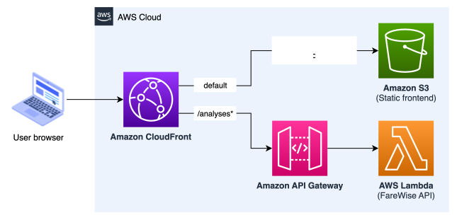
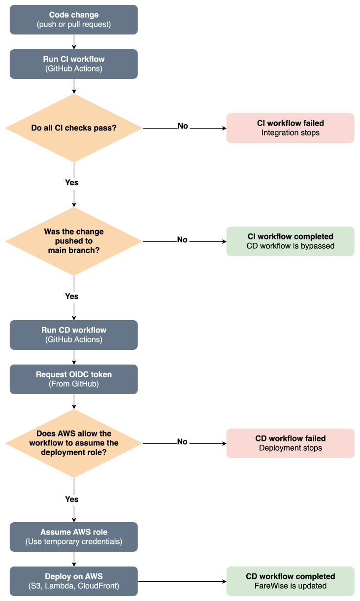

<p align="center">
  
</p>

## Turn your TfL history into future fare savings

FareWise is a Transport for London (TfL) fare optimisation tool that analyses historical journey data and compares payment strategies to identify the lowest-cost option. It currently supports London Underground, Overground, DLR and bus journeys, with support for other TfL modes planned for later.

To use FareWise, download a TfL journey history CSV from your Oyster or contactless account and upload it through the web interface.

**[Go to the FareWise web interface](https://farewise.uk/)**

FareWise can also be run locally:

```bash
python farewise.py journey_history.csv
```

## How the comparison works

FareWise compares PAYG (Pay as you go), Travelcards, and Bus & Tram Passes using TfL’s published fare information from the [TfL fares page](https://tfl.gov.uk/fares/new-fares).

FareWise compares strategies including:

```text
PAYG only
Zone 1    Travelcard + PAYG outside Zone 1
Zones 1–2 Travelcard + PAYG outside Zones 1–2
Zones 1–3 Travelcard + PAYG outside Zones 1–3
Zones 1–4 Travelcard + PAYG outside Zones 1–4
Zones 1–5 Travelcard + PAYG outside Zones 1–5
Zones 1–6 Travelcard
Bus & Tram Pass + PAYG for rail journeys
Bus & Tram Pass + Travelcard + PAYG outside the Travelcard zones
```

For each zone range, FareWise tests non-annual Travelcard durations:

```text
1 Day Anytime
1 Day Off-Peak
7 Day
Monthly
```

Date-based payment options are tested across the journey history. For example, a 7 Day Travelcard or 7 Day Bus & Tram Pass could start on different days, so FareWise checks the possible validity periods and calculates the resulting total journey cost.

When passes are combined, FareWise applies each pass only to the journeys it covers. Bus and tram journeys can be covered by a Bus & Tram Pass, journeys within the selected Travelcard zones can be covered by the Travelcard, and any remaining journeys are charged using PAYG.

FareWise compares all tested strategies and reports the cheapest estimated option.

## AWS architecture

FareWise uses a serverless AWS architecture with Amazon CloudFront as the public entry point. Static frontend assets are served from a private Amazon S3 bucket through CloudFront Origin Access Control (OAC), while requests matching `/analyses*` are routed through Amazon API Gateway to the AWS Lambda function that runs the FareWise API.

<p align="center">
  
</p>

<p align="center"><em>Figure 1. FareWise AWS architecture.</em></p>

## CI/CD workflow

FareWise uses GitHub Actions for continuous integration and deployment. CI runs automated tests and Terraform checks for code changes. For changes pushed to the main branch, the CD workflow uses GitHub OIDC to assume an AWS IAM deployment role with temporary credentials before deploying updates to AWS (S3, Lambda, CloudFront).

<p align="center">
  
</p>

<p align="center"><em>Figure 2. FareWise CI/CD workflow.</em></p>
