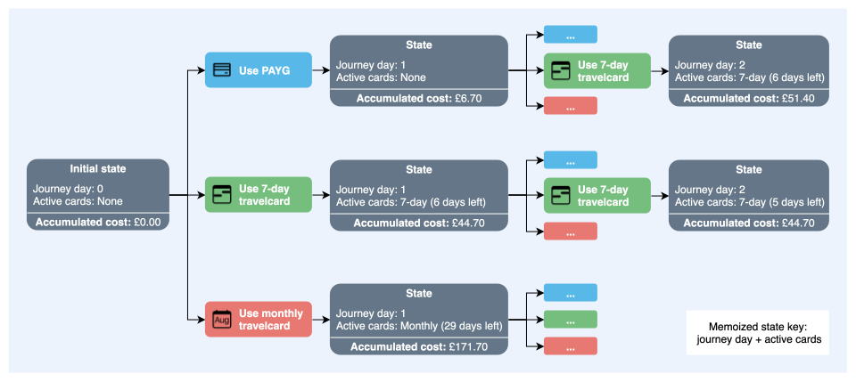

<p align="center">
  
</p>

## Turn your TfL history into future fare savings

FareWise is a Transport for London (TfL) fare optimisation tool that analyses historical journey data and compares payment strategies to identify the lowest-cost option. It currently supports London Underground, Overground, DLR and bus journeys, with support for other TfL modes planned for later.

To use FareWise, download a TfL journey history CSV from your Oyster or contactless account and upload it through the web interface.

**[Go to the FareWise web interface](https://farewise.uk/)**

FareWise can also be run locally:

```bash
python farewise.py journey_history.csv
```

## How the comparison works

FareWise compares PAYG (Pay As You Go), Travelcards, and Bus & Tram Passes using TfL’s published fare information from the [TfL fares page](https://tfl.gov.uk/fares/new-fares).

The optimizer uses recursion to explore valid fare choices across the journey history. For each day, FareWise considers the current *state*, including any active Travelcard or Bus & Tram Pass.

The recursion moves forward to the end of the journey history, where the future cost is zero, and then resolves backwards. This means the final journey day is evaluated first. At each state, FareWise asks: “If I choose this option today, what is the cheapest way to pay for the remaining journeys?” By comparing these choices, the optimizer finds the fare strategy with the lowest total estimated cost.

Figure 1 shows the state exploration conceptually. For clarity, only a subset of fare products and branches is shown.


<p align="center">

</p>

<p align="center"><em>Figure 1. Conceptual view of FareWise state exploration during optimization.</em></p>

FareWise uses memoization to avoid repeating work. Once the cheapest continuation from a state has been calculated, the result is cached. If the optimizer reaches the same state again, it reuses the cached result instead of recursively exploring the same remaining choices again.


## AWS architecture

FareWise uses a serverless AWS architecture with Amazon CloudFront as the public entry point. Static frontend assets are served from a private Amazon S3 bucket through CloudFront Origin Access Control (OAC), while requests matching `/analyses*` are routed through Amazon API Gateway to the AWS Lambda function that runs the FareWise API.

<p align="center">
  
</p>

<p align="center"><em>Figure 2. FareWise AWS architecture.</em></p>

## CI/CD workflow

FareWise uses GitHub Actions for continuous integration and deployment. CI runs automated tests and Terraform checks for code changes. For changes pushed to the main branch, the CD workflow uses GitHub OIDC to assume an AWS IAM deployment role with temporary credentials before deploying updates to AWS (S3, Lambda, CloudFront).

<p align="center">
  
</p>

<p align="center"><em>Figure 3. FareWise CI/CD workflow.</em></p>
